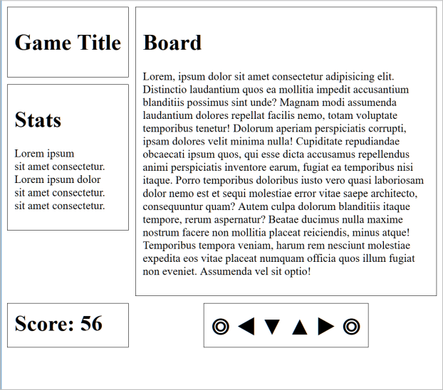

# Les 9 - Gevorderde oefeningen H10 - Lay-out in een raster - Grid

Download of clone deze repository.

De Developer Tools van de browser Mozilla Firefox zijn handiger om te werken met Grid Layout en Flexbox Layout dan de Developer Tools van Google Chrome. Gebruik dus voor deze oefeningen Mozilla Firefox in plaats van Google Chrome.

## Oefening 1 - Game page

Open de map **gamepage** met startbestanden in Visual Studio Code en bekijk hieronder de eerste schermafbeelding.

Voer de volgende aanpassingen uit:

1. Voeg onder het `h1`element in het **Board**-item een `p`element toe met daarin 120 'lorem ipsum'-woorden. Je kan hiervoor gebruikmaken van emmet: `p>lorem120`
2. Creëer een grid bestaande uit twee kolommen en drie rijen.
   - De eerste kolom is voor de 'Game Title', de 'Stats' en de 'Score'. 
Deze kolom moet de breedte krijgen van de inhoud (content). Je stelt deze dus in op 'auto'.
De tweede kolom is voor het 'Board' en de 'Controls' en krijgt alle overblijvende ruimte (leftover space).
   - Voor de eerste en de laatste rij moet de hoogte aangepast worden aan de inhoud.
De middelste rij krijgt alle overgebleven ruimte.
3. Positioneer de vijf items op de grid. Maak voor het positioneren van de grid items gebruik van `grid-column` en `grid-row`. Het **Board**-item overspant twee grid-rijen. Het **Controls**-item is gecentreerd onder het **Board**-item.
 
   

4. Zorg ervoor dat het **Stats**-item niet mee verhoogt als de pagina smaller wordt. Zie onderstaande schermafbeelding:

   

## Oefening 2 - Reponsive form

Open de map **responsive-form** met startbestanden in Visual Studio Code. 

<!---
.pdf eventueel nog verplaatsen naar de website
-->
De bedoeling van deze oefening is om het formulier uit onderstaande animatie te maken. De formulierontwerpen vind je in [responsive_form.pdf](assets/responsive_form.pdf) en de witruimte tussen de controls is 10px. Denk na over hoe je dit gaat aanpakken en lees daarna eventueel ook nog onderstaande tips.

Tips: 
- Maak gebruik van grid-template-areas en kies korte namen voor de grid-areas, bijv. maximum 3 letters.
- Het is niet nodig om iets te wijzigen aan de HTML, je kan naar de labels verwijzen met behulp van een geavanceerde CSS selector.

## Oefening 3 - Fotogalerij

Open de map **fotogalerij** met startbestanden in Visual Studio Code. 

In de basis-oefeningen hebben we met behulp van @media een 'responsive' fotogalerij gemaakt. 

Met CSS grid is het nu ook mogelijk om een 'responsive' fotogalerij te maken zonder gebruik te maken van media queries.

Pas de HTML- en CSS-code aan zodat de breedte van de pagina volledig opgevuld wordt met foto's. De foto's mogen nooit smaller worden dan 200 pixels en de overblijvende ruimte moet gelijk verdeeld worden over de verschillende foto's. De ruimte tussen de foto's is overal 15 pixels. Hieronder vind je drie schermafbeeldingen bij verschillende paginabreedtes.

**Schermafbeelding bij een paginabreedte van 800 pixels.**

 
**Schermafbeelding bij een paginabreedte van 1024 pixels.**

**Schermafbeelding bij een paginabreedte van 2090 pixels.**

